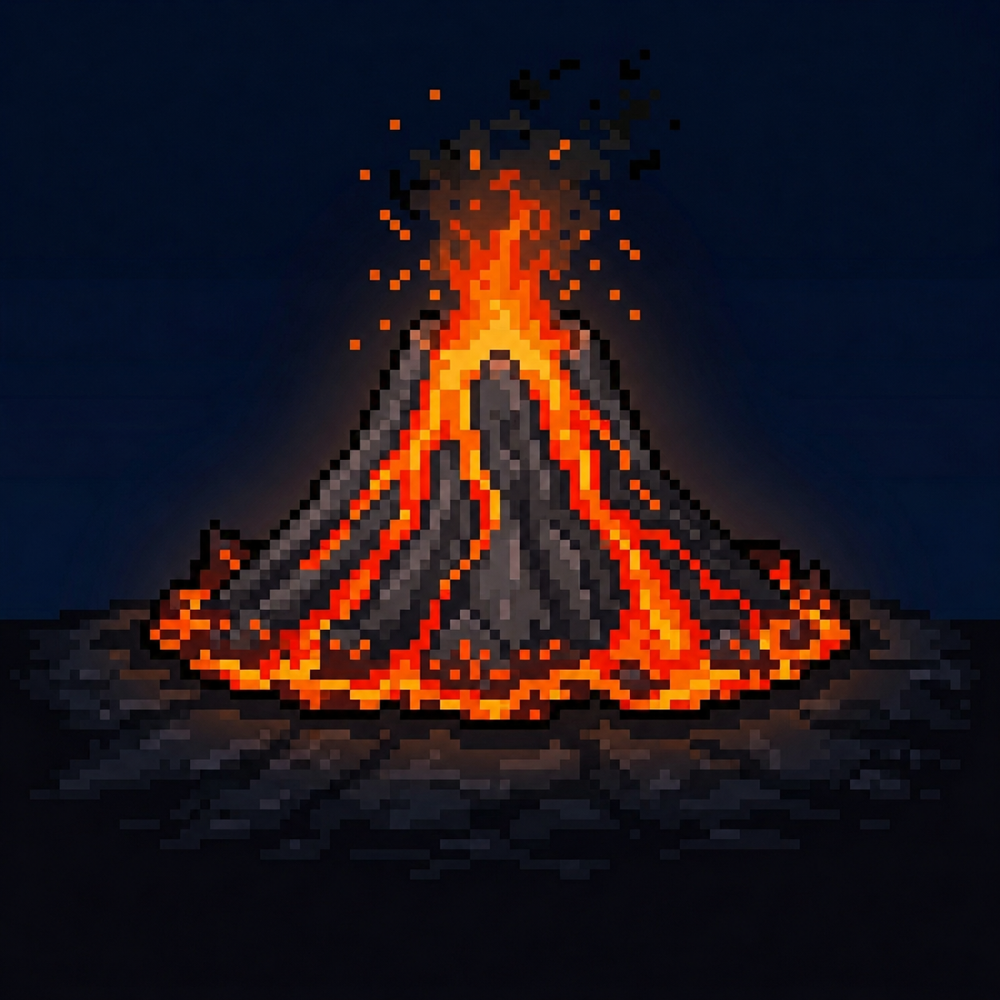

<div align="center">



# Volcanic

### A Vulkan renderer for Minecraft — cross-platform, tuned for macOS, with native shaders & lighting.

<em>Fork of <a href="https://github.com/xCollateral/VulkanMod">VulkanMod</a> (NeoForge 1.21.1). Replaces Minecraft's OpenGL renderer with Vulkan on Windows, Linux and macOS (Apple Silicon &amp; Intel, through MoltenVK).</em>

<br/>

<a href="https://www.minecraft.net/"></a>
<a href="https://neoforged.net/"></a>


<a href="https://discord.gg/fXTbnFhumY"></a>
<a href="LICENSE"></a>
<a href="https://github.com/NelWenn/Volcanic/stargazers"></a>
<a href="https://github.com/NelWenn/Volcanic/releases/latest"></a>

<br/>

**[⬇ Download](https://github.com/NelWenn/Volcanic/releases/latest) · [✨ Features](#-features) · [💾 Install](#-install) · [⚙️ Configuration](#️-configuration) · [🛠 Build](#-build-from-source) · [💬 Discord](https://discord.gg/fXTbnFhumY)**

</div>

---

**Volcanic** is a performance-focused fork of VulkanMod for **NeoForge 1.21.1**. It swaps Minecraft's
aging OpenGL renderer for a modern **Vulkan** backend that runs from a single jar on Windows, Linux and
macOS, with extra work put into running well on macOS (Apple Silicon and Intel) through
[MoltenVK](https://github.com/KhronosGroup/MoltenVK).

On top of the renderer it adds a **native Vulkan post-process pipeline**: real-time sun/moon
**shadow mapping**, **volumetric height fog** with screen-space **god-rays**, a per-pixel
**point-light and lightmap system**, **color grading**, **TAA**, and **render-scale upscaling** — all
rendered directly in the Vulkan path, no OpenGL shim.

The wider goal is **mod compatibility**: getting mods that expect OpenGL to render correctly under
Vulkan, and adding programmable core-shader support (Sodium-style) so packs and mods like Create work
without falling back to OpenGL. That work is ongoing.

> [!IMPORTANT]
> **Unofficial fork.** Volcanic is not affiliated with, nor endorsed by, the original VulkanMod project
> or the Reforged maintainer. The "VulkanMod" name and logo belong to the original project. See
> [Lineage & credits](#-lineage--credits).

---

## ✨ Features

<table>
<tr>
<td width="50%" valign="top">

### 🌋 Vulkan renderer
Minecraft's OpenGL renderer replaced with a modern **Vulkan** backend — lower driver overhead,
better frame pacing, and a foundation for real GPU features.

### 🍎 Native macOS
Boots and renders on **Apple Silicon & Intel Macs** via **MoltenVK** (Vulkan → Metal). One jar,
three platforms — no JVM args, no agents, no `Unsafe` hacks.

### 🎨 Native post-process shaders
A Vulkan post pipeline with **color grading** (exposure / contrast / saturation / temperature),
**volumetric height fog**, and screen-space **god-rays**.

### ☀️ Sun & moon shadow mapping
A real shadow map (second camera-relative terrain pass) with **Vogel-disk PCF**, slope-scaled bias
and texel snapping — day *and* night, with a resolution **quality slider**.

</td>
<td width="50%" valign="top">

### 🟦 TAA
**Temporal accumulation** smooths shadow shimmer and sub-pixel crawl for a stable image in motion.

### 🖥️ Render-scale upscaling
**FSR-style** dynamic resolution: render below native (50–100%) and upscale to the display for extra
frames on demand.

### ⚡ Aggressive culling
Entity, block-entity, **leaves**, and particle culling, indirect draw, adaptive chunk uploads and
tunable **performance presets**.

### 📊 GPU frame timing
Built-in **Vulkan timestamp** GPU timing so you can see where frame time actually goes.

</td>
</tr>
</table>

---

## 🚀 What this fork adds (vs VulkanMod Reforged)

**macOS / cross-platform**

- **macOS/NeoForge startup crash fixed** — Reforged crashed on macOS with
  `NoClassDefFoundError: org.lwjgl.vulkan.VK`. NeoForge loads the bundled `lwjgl-vulkan` into the
  *game* module layer, but `org.lwjgl.glfw.GLFWVulkan` lives in the *boot* layer and cannot read it
  (the Java module system only resolves upward). Volcanic stops referencing `GLFWVulkan` altogether:
  the required instance extensions and the window surface are built directly from game-layer code
  (`net.vulkanmod.vulkan.VkSurfaceUtil`), which *can* see the Vulkan classes.
- **macOS surface path** — creates a `CAMetalLayer`, attaches it to the window's content view, applies
  the Retina `contentsScale`, and creates the surface via `VK_EXT_metal_surface` (MoltenVK).
- **One cross-platform jar** — bundles the LWJGL Vulkan / shaderc / vma natives for Windows, Linux and
  macOS (x86-64 + Apple Silicon).
- **Case-sensitive shader-load crash fixed** — a shader shipped as `terrain_Z.fsh` but was loaded as
  `terrain_z.fsh`; harmless on case-insensitive filesystems (macOS dev), fatal inside the jar.

**New rendering features**

- Native Vulkan **post-process pipeline** (color grading · volumetric height fog · god-rays).
- **Sun/moon shadow mapping** with PCF, slope bias, day/night and a resolution quality slider.
- **Lighting system** — custom lightmap (night/cave darkening, warm torch light), per-pixel
  **point lights** from emissive blocks with per-block colours, and a handheld dynamic light.
- **TAA** temporal accumulation and **render-scale upscaling**.
- Heavy effects evaluated at **half resolution** with a bilateral upsample to keep the cost down at
  Retina resolutions.
- **GPU frame timing** via Vulkan timestamp queries.

---

## 📦 Requirements

| | |
|---|---|
| **Minecraft** | 1.21.1 |
| **Mod loader** | NeoForge **21.1.x** |
| **Java** | 21 |
| **GPU** | Any Vulkan-capable GPU. On macOS, Vulkan runs through the bundled **MoltenVK** (Apple Silicon & Intel). |

---

## 💾 Install

> [!WARNING]
> **Volcanic is a complete, standalone build of VulkanMod — install *only* this jar.**
> Do **not** also install the original VulkanMod or VulkanMod Reforged: they share the same mod id
> (`vulkanmod`) and will conflict. Volcanic already contains the whole renderer plus the macOS fixes.

1. Install [NeoForge](https://neoforged.net/) for Minecraft **1.21.1**.
2. Download the latest `Volcanic-<version>.jar` from the [**Releases**](https://github.com/NelWenn/Volcanic/releases/latest) page.
3. Drop it into your instance's `mods/` folder (and remove any other VulkanMod / Reforged jar).
4. Launch. Volcanic *replaces* the renderer — don't combine it with other renderer-replacing mods
   (Sodium / Embeddium, etc.).

---

## ⚙️ Configuration

Everything is in **Options → Video Settings**:

- **Performance** — performance presets, chunk uploads, culling (entities, block entities, leaves,
  particles), indirect draw, render device selection.
- **Render scale** — dynamic resolution / upscaling (50–100%).
- **Shaders** tab — enable the post-process pipeline, pick an effect, and tune it live:
  - Color grading: exposure · contrast · saturation · temperature
  - Volumetric fog: density · height
  - Shadows: on/off · **quality** slider · TAA on/off

---

## 🛠 Build from source

Requires a **JDK 21**.

```bash
git clone https://github.com/NelWenn/Volcanic.git
cd Volcanic

./gradlew build      # -> build/libs/Volcanic-<version>.jar
./gradlew runClient  # launch a dev client
```

---

## 🖼️ Gallery

<div align="center">

<em>Screenshots coming soon — join the <a href="https://discord.gg/fXTbnFhumY">Discord</a> for the latest.</em>

<!-- Drop images into docs/ and uncomment:


-->

</div>

---

## 🧬 Lineage & credits

Volcanic stands on the work of the upstream authors — the Vulkan renderer and the NeoForge port are
**their** work; this fork adds the macOS support and the rendering features. All licensed under
**LGPL-3.0-only**:

| Project | Author | Link |
|---|---|---|
| VulkanMod (original, Fabric) | **xCollateral** & contributors | <https://github.com/xCollateral/VulkanMod> |
| VulkanMod Reforged (NeoForge port) | **Rindw / TrulyRin** | <https://github.com/TrulyRin/VulkanMod-Reforged> |
| **Volcanic** (this fork) | **NelWenn** | <https://github.com/NelWenn/Volcanic> |

Please support the upstream projects ⭐.

---

## 📜 License

Volcanic remains licensed under the **GNU Lesser General Public License v3.0 only**. See
[`LICENSE`](LICENSE) (LGPLv3), [`COPYING`](COPYING) (GPLv3, referenced by the LGPL) and
[`NOTICE`](NOTICE) (attribution and the required notice of changes).

---

<div align="center">

### 💬 Community

Questions, bug reports, screenshots and builds live on Discord.

<a href="https://discord.gg/fXTbnFhumY"></a>

<sub>Volcanic is an unofficial fork and is not affiliated with Mojang, Microsoft, or the VulkanMod project.</sub>

</div>
