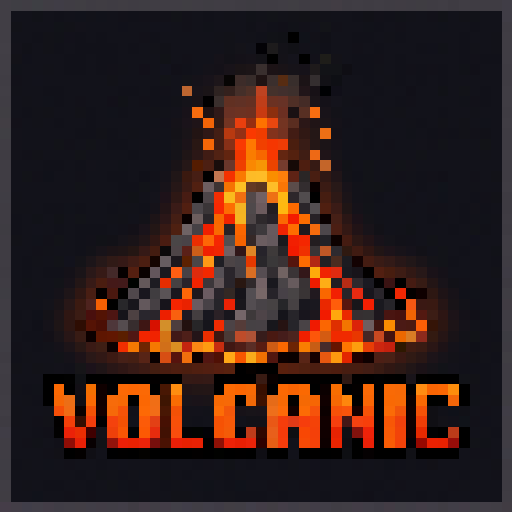

<div align="center">



# Volcanic

### A cross-platform Vulkan engine for Minecraft.

<em>Fork of <a href="https://github.com/xCollateral/VulkanMod">VulkanMod</a> (NeoForge 1.21.1) — pushing Vulkan on Minecraft further: performance, compatibility, and a native shader pipeline.</em>

<br/>

<a href="https://www.minecraft.net/"></a>
<a href="https://neoforged.net/"></a>


<a href="https://discord.gg/fXTbnFhumY"></a>
<a href="LICENSE"></a>
<a href="https://github.com/NelWenn/Volcanic/stargazers"></a>
<a href="https://github.com/NelWenn/Volcanic/releases"></a>

<br/>

**[Download](https://github.com/NelWenn/Volcanic/releases) · [Features](#features) · [Install](#install) · [Build](#build-from-source) · [Discord](https://discord.gg/fXTbnFhumY)**

</div>

---

**Volcanic** is a fork of VulkanMod for **NeoForge 1.21.1** that replaces Minecraft's aging OpenGL
renderer with a modern **Vulkan** backend — from a single jar on **Windows, Linux and macOS**
(Apple Silicon & Intel, through [MoltenVK](https://github.com/KhronosGroup/MoltenVK)).

The goal is to take Vulkan on Minecraft further: more performance through modern GPU techniques,
broad mod and resource-pack compatibility, a native shader system, and — over time — a real engine
to push the game and its rendering beyond what the vanilla pipeline allows.

> [!IMPORTANT]
> **Unofficial fork.** Volcanic is not affiliated with, nor endorsed by, VulkanMod or its Reforged
> maintainer. The "VulkanMod" name and logo belong to the original project.
> See [Lineage & credits](#lineage--credits).

---

## Features

**Vulkan renderer** — Minecraft's OpenGL renderer replaced with a modern Vulkan backend: lower driver
overhead, better frame pacing, and a foundation for real GPU features. One jar, three platforms —
including native macOS support through MoltenVK, which upstream VulkanMod doesn't handle.

**Performance** — advanced Vulkan techniques to squeeze out more frames: occlusion culling, entity /
block-entity / particle culling, indirect draw, adaptive chunk uploads, render-scale upscaling and
tunable performance presets.

**Shader system** — an Iris-like shader pipeline built natively on Vulkan, with its own rendering
path: real-time sun/moon shadows, volumetric fog and god-rays, per-pixel lighting, screen-space water
& glass reflections, and color grading — with the goal of letting anyone write shaders for it.

**Mod & pack compatibility** — resource packs and mods that used to need OpenGL, Continuity or
OptiFine render natively in Vulkan: OptiFine **CTM** & **CIT**, **Polytone**, and Sodium-style core
shaders (**SCSS**). See the [changelog](CHANGELOG.md).

**A real engine (planned)** — the longer-term direction is a proper Vulkan game engine that pushes
Minecraft's rendering and capabilities further than the vanilla pipeline was built for.

> Deep technical details will live in a developer wiki. This page stays intentionally short.

---

## Requirements

| | |
|---|---|
| **Minecraft** | 1.21.1 |
| **Mod loader** | NeoForge **21.1.x** |
| **Java** | 21 |
| **GPU** | Any Vulkan-capable GPU. On macOS, Vulkan runs through the bundled MoltenVK (Apple Silicon & Intel). |

---

## Install

> [!WARNING]
> **Volcanic is a complete, standalone build of VulkanMod — install *only* this jar.**
> Don't also install the original VulkanMod or VulkanMod Reforged: they share the same mod id
> (`vulkanmod`) and will conflict.

1. Install [NeoForge](https://neoforged.net/) for Minecraft **1.21.1**.
2. Download the latest `Volcanic-<version>.jar` from the [**Releases**](https://github.com/NelWenn/Volcanic/releases) page (currently an **alpha** pre-release).
3. Drop it into your instance's `mods/` folder (and remove any other VulkanMod / Reforged jar).
4. Launch. Volcanic *replaces* the renderer — don't combine it with other renderer-replacing mods
   (Sodium / Embeddium, etc.).

Everything is configured in **Options → Video Settings**; pack compatibility activates automatically
when a supported pack is loaded.

---

## Build from source

Requires a **JDK 21**.

```bash
git clone https://github.com/NelWenn/Volcanic.git
cd Volcanic

./gradlew build      # -> build/libs/Volcanic-<version>.jar
./gradlew runClient  # launch a dev client
```

---

## Lineage & credits

Volcanic stands on the work of the upstream authors — the Vulkan renderer and the NeoForge port are
**their** work; this fork builds on top of it. All licensed under **LGPL-3.0-only**:

| Project | Author | Link |
|---|---|---|
| VulkanMod (original, Fabric) | **xCollateral** & contributors | <https://github.com/xCollateral/VulkanMod> |
| VulkanMod Reforged (NeoForge port) | **Rindw / TrulyRin** | <https://github.com/TrulyRin/VulkanMod-Reforged> |
| **Volcanic** (this fork) | **NelWenn** | <https://github.com/NelWenn/Volcanic> |

**Contributors**

- **[RevoIDE](https://github.com/RevoIDE)** — annotation-driven pipeline engine and the Java frame-graph
  foundation the shader system is built on; plus the Wayland/GLFW startup-crash fix.
- **[NelWenn](https://github.com/NelWenn)** — macOS/Metal support, the shader & lighting stack,
  reflections, and the mod/pack compatibility layers.

Please support the upstream projects ⭐.

---

## License

Volcanic remains licensed under the **GNU Lesser General Public License v3.0 only**. See
[`LICENSE`](LICENSE) (LGPLv3), [`COPYING`](COPYING) (GPLv3, referenced by the LGPL) and
[`NOTICE`](NOTICE) (attribution and the required notice of changes).

---

<div align="center">

### Community

Questions, bug reports, screenshots and builds live on Discord.

<a href="https://discord.gg/fXTbnFhumY"></a>

<sub>Volcanic is an unofficial fork and is not affiliated with Mojang, Microsoft, or the VulkanMod project.</sub>

</div>
